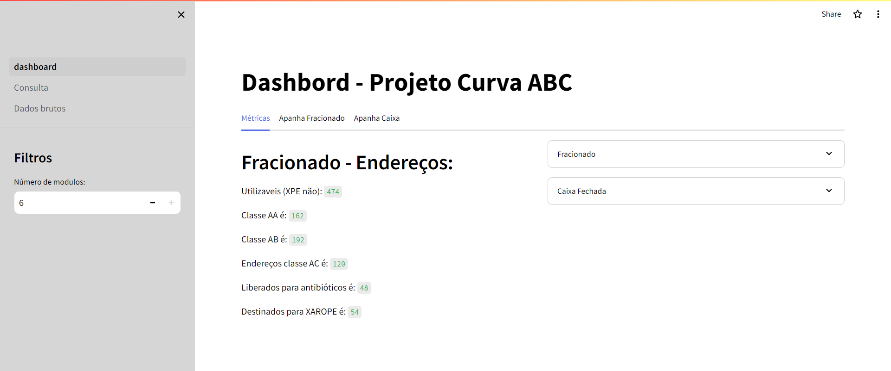

# Projeto Curva ABC

> Dê uma olhada no [projeto final](https://projeto-curva-abc.streamlit.app)!
>
> Leia também sobre o [desenvolvimento do projeto]().
>
> Documentação tecnica do [projeto da curva abc]().

## Descrição

Meu primeiro projeto de Analise de dados.

É um projeto que foi desenvolvido por mim, onde foram colocados em pratica os conhecimentos adquiridos na [formação de Ciencia de Dados](https://cursos.alura.com.br/degree/certificate/72841079-c405-4a94-af5d-e260c9451c76) da escola de tecnologia online [Alura](https://www.alura.com.br/).

Objetivo do projeto:

* Trazer para o meu ambiente de trabalho uma ferramenta diferenciada e desenvolver novas habilidades na minha area de trabalho pretendida.

* Facilitar e trazer eficiencai para a analise dos dados da Curva ABC baseado no estoque fisico e sua orientação.

* 

## Sobre o Projeto

Como o projeto esta estruturado?

### Setup de ambiente:

* 

### Como rodar localmente?

* 

## Projeto-Curva-ABC.app

### Estrutura do projeto